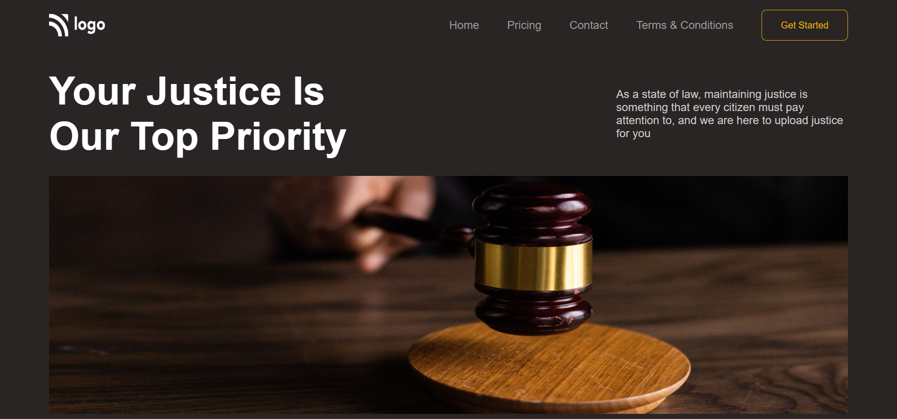

# Justice Landing Page
> _by Saloni_

This webpage titled Justice is made using HTML and CSS. As a part of Full Stack JavaScript Bootcamp, its the 6th project given by the course provider.

 * ## Tech Stack

    
    
    
    

 * ## Knowledge Gained

   1. Confidently creating webpage using HTML & CSS.

 * ## Output:

   